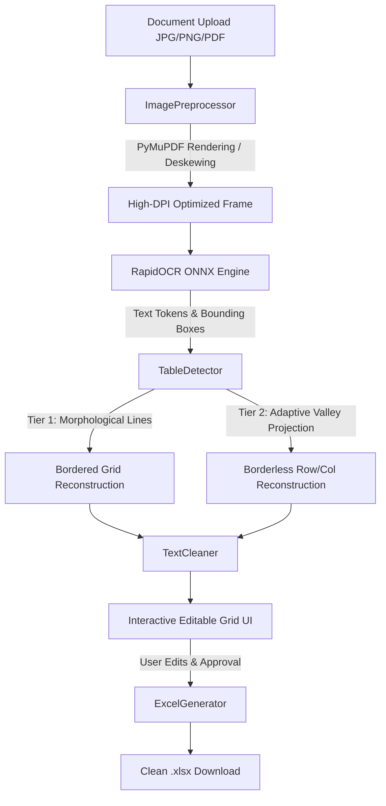

# SheetSnap Desktop 📊

**SheetSnap Desktop** is a high-performance, enterprise-grade offline desktop application that automatically extracts structured tables from images (`JPG`, `JPEG`, `PNG`) and `PDF` documents (such as purchase orders, invoices, requisitions, inventory logs, and financial statements) and exports them directly into Microsoft Excel (`.xlsx`).

Designed with a sleek, minimalist aesthetic, SheetSnap runs **100% locally and offline** without requiring cloud APIs, internet access, external database servers, or user logins.

---

## ✨ Key Features

* **100% Offline & Completely Private** — Zero external network requests, telemetry, or cloud dependencies. All OCR, image processing, and layout reconstruction occurs strictly on your local machine.
* **Lean, CPU-Optimized Footprint (~380 MB)** — Powered by an ultra-lightweight ONNX OCR runtime without requiring heavy multi-gigabyte machine learning frameworks (no PyTorch, no PaddlePaddle).
* **Multi-Format Document Support** — Native drag-and-drop ingestion for `JPG`, `JPEG`, `PNG`, and single/multi-page `PDF` documents.
* **Dual-Tier Topological Table Reconstruction**:
  * **Tier 1 (Bordered Tables):** Morphological grid line extraction and line intersection mapping for exact cell boundary resolution.
  * **Tier 2 (Borderless Tables):** Adaptive dynamic row overlap clustering, horizontal whitespace valley projection, and multi-line continuation merging.
* **Intelligent Text Normalization** — Automated cleaning for stuck character codes, unit spacing (e.g., `250.MTR` → `250. MTR`), comma separation, and OCR artifact suppression.
* **Interactive Live Spreadsheet Editor** — Preview and modify extracted tabular data in real time, add/remove rows and columns, and verify values before exporting.
* **Instant Excel (.xlsx) Export** — Generates clean, unformatted workbooks with bold headers compatible with Microsoft Excel, Google Sheets, and LibreOffice Calc.
* **Automated Ephemeral Cleanup** — Uploaded files and generated previews are automatically purged from memory immediately after processing.

---

## 🛠️ Tech Stack

### Frontend
| Technology | Version | Purpose |
| :--- | :--- | :--- |
| **Next.js** | 16 (App Router) | Modern React framework & UI routing |
| **React** | 19 | Reactive state management & component hierarchy |
| **Tailwind CSS** | 4 | Utility-first styling & dark/light theme tokens |
| **Lucide React** | Latest | Minimalist SVG iconography |

### Backend & Core Engine
| Technology | Purpose |
| :--- | :--- |
| **FastAPI & Uvicorn** | High-performance asynchronous REST API backend |
| **RapidOCR (ONNX Runtime)** | Sub-second CPU-optimized OCR text detection & recognition |
| **OpenCV Contrib (Headless)** | Computer vision, morphological filtering & deskewing |
| **PyMuPDF (`fitz`)** | Vector & raster PDF rendering at high DPI |
| **OpenPyXL** | Native Excel (`.xlsx`) binary serialization |
| **Pydantic v2** | Strict schema validation and settings management |

---

## 🚀 Getting Started

### Prerequisites

Ensure you have the following installed on your workstation:
* **Python:** 3.8 to 3.12 (`python --version`)
* **Node.js:** 18.x or 20.x+ (`node --version`) and `npm`
* **Git**

---

### 1. Clone the Repository

```bash
git clone https://github.com/YOUR_USERNAME/sheetsnap-desktop.git
cd sheetsnap-desktop
```

---

### 2. Backend Setup (FastAPI & OCR Engine)

#### A. Create a Virtual Environment

```bash
# Windows
python -m venv venv

# macOS / Linux
python3 -m venv venv
```

#### B. Activate the Virtual Environment

```powershell
# Windows (PowerShell)
.\venv\Scripts\Activate.ps1

# Windows (Command Prompt)
venv\Scripts\activate.bat

# macOS / Linux
source venv/bin/activate
```

#### C. Install Python Dependencies

```bash
pip install --upgrade pip
pip install -r requirements.txt
```

#### D. Start the Backend Server

```bash
python -m backend.app
```
> The backend API will start and listen locally at `http://127.0.0.1:8000`.

---

### 3. Frontend Setup (Next.js & UI)

Open a separate terminal window and navigate to the `frontend` folder:

```bash
cd frontend
```

#### A. Install Node Dependencies

```bash
npm install
```

#### B. Start the Frontend Development Server

```bash
npm run dev
```

Open your browser and navigate to:
```text
http://localhost:3000
```

---

## 📂 Project Structure

```text
sheetsnap-desktop/
├── backend/
│   ├── app.py                      # FastAPI server entry point and CORS configuration
│   ├── routes.py                   # REST endpoints: /extract and /export
│   ├── config.py                   # Global environment and directory settings
│   └── services/
│       ├── preprocess.py           # Image decoding, PDF DPI rasterization & deskewing
│       ├── ocr_engine.py           # Singleton RapidOCR ONNX wrapper
│       ├── table_detector.py       # Two-Tier table extraction & reconstruction engine
│       ├── cleaner.py              # Regex text cleaning & cell formatting
│       └── excel.py                # OpenPyXL spreadsheet generator
│
├── frontend/
│   ├── app/
│   │   ├── layout.tsx              # Application shell layout and font imports
│   │   ├── page.tsx                # Main single-page workflow & state orchestration
│   │   └── globals.css             # Tailwind design tokens and layout styling
│   ├── components/
│   │   ├── Header.tsx              # Top navigation bar with offline status badge
│   │   ├── UploadZone.tsx          # Drag-and-drop document upload area
│   │   ├── ImagePreview.tsx        # High-resolution document viewer
│   │   └── EditableGrid.tsx        # Interactive spreadsheet table editor
│   ├── lib/
│   │   └── types.ts                # TypeScript interface definitions
│   └── package.json
│
├── test_images/                    # Benchmark sample documents and invoices
├── requirements.txt                # Lean, CPU-optimized Python dependency manifest
├── .gitignore                      # Git exclusion rules for builds and venvs
└── README.md                       # Comprehensive project documentation
```

---

## 🔄 Processing Pipeline



1. **Document Decoding & DPI Enhancement:** PDFs are rasterized at 300 DPI via `fitz`. Images undergo intelligent contrast normalization and resolution scaling.
2. **RapidOCR Inference:** Lightweight ONNX models perform single-pass text detection and character recognition on CPU in milliseconds.
3. **Topological Table Extraction:**
   * **Tier 1 (Bordered):** Detects horizontal and vertical morphological lines to establish bounding intersection cells.
   * **Tier 2 (Borderless):** Clusters lines using vertical bounding-box overlap and projects whitespace valleys across columns.
4. **Text Cleaning & Formatting:** Cleans stuck character codes, formats numbers, and stitches wrapped multi-line descriptions.
5. **Interactive Review:** Users review the extracted table in the browser, making edits if needed.
6. **Excel Serialization:** Generates clean `.xlsx` spreadsheets ready for immediate business use.

---

## 🔒 Security & Privacy

SheetSnap Desktop is built specifically for strict privacy and data protection requirements:
* **Zero Telemetry or External Network Calls**
* **Zero Third-Party Cloud APIs**
* **No Database Storage or Persisted User Data**
* **No Login or Credential Tracking**
* **Automated Ephemeral Memory Purging**

All documents remain on your workstation.

---

## 📄 License

**Internal Enterprise Application — All Rights Reserved.**
